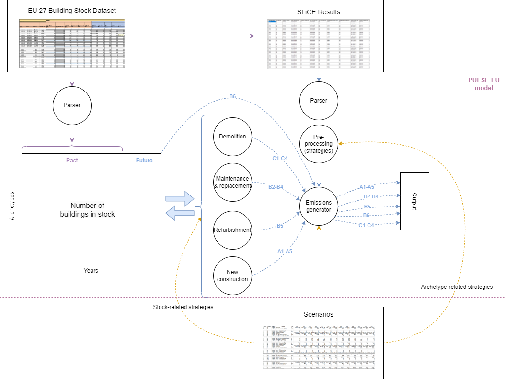
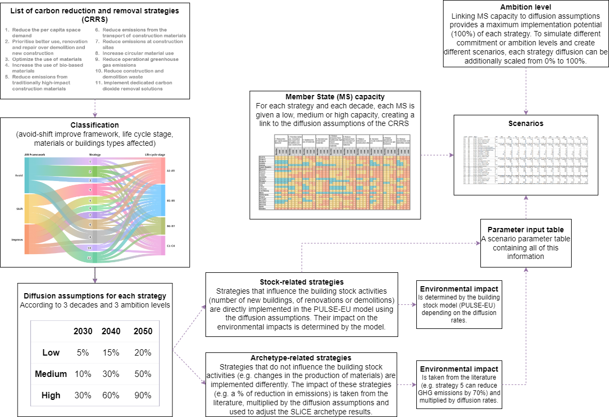

# PULSE-EU

This model allows for the Prospective Upscaling of Life cycle Scenarios and Environmental impacts of European buildings (PULSE-EU). This model can forecast the environmental impact of a country's building stock within the EU27, from 2020 to 2050, by adjusting various parameters.




## Setup

The recommended environment for the model is specified in ``environment.yml`` and can be installed and activated with conda using the following command:
```
conda env create -f environment.yml && conda activate PULSE-EU
```

This helps achieve equal results across different systems and platforms.


## Quick start

To run the model it needs to be initialized using this command:
```
python pulse_eu.py initialize
```

After the model is initialized, scenarios can be run using this command:
```
python pulse_eu.py scheduler [Commitment file]
```

The output can be found afterwards in `output/runs/`

For more details see **[Initializing the model](#initializing-the-model)** and **[Running the model](#running-the-model)**


## Initializing the model

PULSE-EU relies on a large collection of data. This data, located in `data\raw\`, needs to be parsed for the model to be able to use it. That is the function of the `initialize` command. It parses, calibrates, and generates the model input files.

The initialization can be run using this command:
`python pulse_eu.py initialize`

The parser will create its output in `data/parsed/**`.

More info can be found in the [Initialization command](#initialization) section.


## Running the model

To run the scheduler, the model needs to be initialized. If that is the case, the model will take the file specified in the `[Commitments file]` parameter and generate the scenarios in that file.

The structure of the file is described in the [Commitments file](#the-commitments-file) section.

This file, together with the files `Capacities.xlsx` and `Strategies.xlsx` generates the scenario input files.
The [Strategies file](#strategies-file) and [Capacities file](#capacities-file) can be specified using the `--strategies-file` and `--capacities-file` parameters, respectively. If not specified, the default files are used.

The name of the [Commitments file](#commitments-file) can be arbitrarily chosen, but needs to be a [Microsoft Excel Open XML Format Spreadsheet (.xlsx)](https://learn.microsoft.com/en-us/openspecs/office_standards/ms-xlsx/) file.

When the `Commitments.xlsx` file is ready, the scenarios can be ran using the following command:
`python pulse_eu.py scheduler Commitments.xlsx`

Note that the file argument should be the relative path to the file, so if the file is placed in the data folder, the path should be  `data/Commitments.xlsx`. Alternatively, the absolute path can also be specified.

If the scheduler is interrupted due to the user cancelling it, the progress is saved and can be resumed by running the exact same command. Note that if different arguments are used or the `Commitments.xlsx` file has changed it will restart from the beginning instead. This also works if a scenario failed due to the user running out of memory or the model crashing for some reason. This behaviour can be switched off by adding the `--reset` flag to the command, which will reset the progress and start from the beginning.

More information can be found in the [Scheduling command](#scheduling) section.


### Running scenarios for a single country

If the user wants to run a scenario for a single country, the scheduler can be ran with the `--generate-only` flag. This will generate the scenario input files for each scenario in the `Commitments.xlsx` file, but will not run the scenarios themselves. The user can then run the scenario for a single country using the `run` command.

More information can be found in the [Running scenarios command](#running-scenarios) section.


## Commands and flags

Running the model with the `--help` flag lists all available parameters for running, as well as a short description for each parameter and flag.

The commands and flags listed here are only the most important ones, and an exhaustive list of flags for each command can be shown by specifying the `--help` flag when running the model.


### List of commands

```
python pulse_eu.py --help
```
  - Adding the --help or -h flag to pulse_eu.py or any subcommand of pulse_eu.py will print out all flags, commands and parameters available for that command and their descriptions.

### Initialization
```
python pulse_eu.py initialize
```
  - Initializes the model as described in **[Initializing the model](#initializing-the-model)**.
  - Accepts the `--folder [Folder]` parameter to allow the user to specify where intermediate initialization files should be stored.

### Scheduling
```
python pulse_eu.py scheduler [Commitments file]
```
  - Runs the model for each scenario specified in the **[Commitments File](#the-commitments-file)**.
  - Accepts the `--strategies-file [Strategies file]` parameter, which overwrites the default [Strategies file](#strategies-file) path.
  - Accepts the `--capacities-file [Capacities file]` parameter, which overwrites the default [Capacities file](#capacities-file) path.
  - Accepts the `--folder [Folder]` parameter to allow the user to specify where the output files should be stored.
  - Accepts the `--countries [Country list]` parameter, which applies the list as a filter of countries to generate, such as `[BE, IT, MT]`.
  - Accepts the `--create-pyam-export` flag, which enables the generation of the pyam export.
  - Accepts the `--merge` flag, which tells the scheduler to merge the output files for each scenario.
  - Accepts the `--full-output` flag, which tells the model to generate the optional indicators as well.
  - Accepts the `--emissions-step-size [Step size]` parameter, which sets the step size of the emission calculations in years.
  - Accepts the `--generate-only` flag, which tells the scheduler to only generate the scenario input files. This is practical for running a scenario for a single country, to e.g. debug the model.
  - Accepts the `--reset` flag, which tells the scheduler to reset the progress and start from the beginning. This is useful if the `Commitments.xlsx` file has changed or if the user wants to restart the scheduler for any reason.

### Running scenarios
```
python pulse_eu.py run [Scenario]
```
  - Runs the scenario specified in the `Scenario` argument
  - To use this command, the scenario input file has to first be generated using the scheduler.
  - Accepts the `--folder [Folder]` parameter to allow the user to specify where the output files should be stored.
  - Accepts the `--create-pyam-export` flag, which enables the generation of the pyam export.
  - Accepts the `--full-output` flag, which tells the model to generate the optional indicators as well.
  - The emission step size is taken from the scenario input file generated by the scheduler


## Scenario output structure
When a scenario is run, it stores its output in `[folder]/runs/[Scenario Name]/`, where `[Scenario Name]` is the scenario identifier based on the country, scenario name and scenario parameters. This name is not guaranteed to be unique, so it is recommended to use different names for scenarios that have similar parameters.

- `emissions.parquet`: The main output of the model. Contains the emission data.
- `pyam_[Scenario Name].csv`: A summary of the scenario run.
- `logs/[Time stamp].log`: The log files of the scenario runs.
- `output.log`: Contains the output of the last scenario run. Only created when the  `--scheduled` flag is set.

Additional files and folders may be created based on the flags specified when running the model (Run the model using the `--help` flag to see all available flags).


### Merging output files
When the `--merge` flag is set, the output files are merged into a single file named `[folder]/merged/[Scenario Name].parquet`, where `[Scenario Name]` is the scenario identifier based on scenario name and scenario parameters.

If the `--create-pyam-export` flag is additionally set, the pyam export is also merged into a single file named `[folder]/merged/pyam_[Scenario Name].csv`.


## Required scenario input files

The scenario modelling framework created considers different carbon reduction strategies (CRS), the capacity of each Member State to implement these strategies and their ambition to do so (as shown in the flowchart below). This framework is flexible and can be used for generating multiple explorative scenarios. It builds on previous work ([Alaux et al., 2024](https://doi.org/10.1016/j.jenvman.2024.122915)).



### Strategies file
The strategies file (.xlsx) specifies the type of CRS (including their scope and application) and their diffusion assumptions (in 2030, 2040 and 2050 for low, medium or high level of ambition).

### Capacities file

The capacities file (.xlsx) specified the capacity of each Member State to implement each CRS (low, medium or high), as defined in [Alaux et al. (2024)](https://doi.org/10.1016/j.jenvman.2024.122915).

### Commitments file
The commitments file is the only one that needs to be changed for generating scenarios, it specifies the ambition level for each strategy (and basically defines which strateies need to be activated in which scenario).

The Commitments file can be either a .xlsx or a .parquet file. Both formats need to follow the same structure.

The Commitments file is structured as follows:

- The first column (`Scenario Name`), holds the base name of the scenario, which can be used to separate different scenarios from each other.
- The second column (`Default`), specifies a fallback value for the application intensity of the strategies and measures.
- The following columns (`CRS [...]`), are used for more fine-grained control of the carbon reduction strategies (CRS) and measures. Whenever a measure does not have a specific value, it falls back to the parent Measure/Strategy's value recursively. If no parent exists, it falls back to the `Default` value.
- When specifying a sub-CRS code, the parent CRS code is required to exist as well, even if it does not have a value specified.
- All major CRS codes from 1 through 10 are required to be present in the Commitments file.
- Example:
  ```
  Scenario Name | Default | CRS 1 | CRS 1.1 | CRS 2 | CRS 2.1
  -----------------------------------------------------------
  Scen_A        | 50      | 60    |         |       |
  Scen_B        | 0       |       | 70      |       |
  ```
  would resolve to:
  ```
  Scenario Name | Default | CRS 1 | CRS 1.1 | CRS 2 | CRS 2.1
  -----------------------------------------------------------
  Scen_A        | 50      | 60    | 60      | 50    | 50
  Scen_B        | 0       | 0     | 70      | 0     | 0
  ```
  Note that the values of parent CRS codes in the resolved table do not impact the values of child CRS codes, so the value of `CRS 1.1` in `Scen_B` is still `70`, even though the parent `CRS 1` has taken on the value `0` from the `Default` column.

- You may also remove sub CRS columns. But due to current code limitations, you must either have all sub CRS columns for a parent CRS code, or none at all. This means that if you have `CRS 1` and `CRS 1.1`, you must also have `CRS 1.2`, `CRS 1.3`, etc., even if they are empty.

For simplicity, it is recommended to use one of the example files as a template for creating a new Commitments file.

An example of a Commitments file can be found in [data/Commitments/BAU Commitments.xlsx](./data/Commitments/BAU%20Commitments.xlsx).
<br>
When creating a new Commitments file, the user should make sure to follow the same naming scheme and have at least a column for every major CRS code like the example file, to allow a successful parsing of the file by the model.


## External Input Data - Sources and Short Description

- **ArchetypeEmissionData**
  - **Source:** [Harmonised database on materials, energy flows and environmental impacts for building archetypes representing the EU27 building stock](https://rdr.kuleuven.be/dataset.xhtml?persistentId=doi:10.48804/VXJUEW)
  - **Short description:** Aggregated life cycle assessment results of the building archetypes in the baseline year using the [SLiCE structure](https://doi.org/10.1016/j.spc.2024.01.005). Full access requires a license to the ecoinvent database (version 3.6). The corresponding authors can be contacted for more information.

- **ArchetypeStockData**
  - **Source:** This was compiled with the support of all partners involved in the [EU-WLC study](https://c.ramboll.com/life-cycle-emissions-of-eu-building-and-construction) from these sources: 
    - [AmBIENCe](https://www.bpie.eu/wp-content/uploads/2022/02/AmBIENCe_D4.1_Database-of-grey-box-model-parameter-values-for-EU-building-typologies-update-version-2-submitted.pdf)
    - [Buiding Stock Observatory](https://building-stock-observatory.energy.ec.europa.eu/factsheets/)
    - [Cost-effectiveness studies](https://circabc.europa.eu/ui/group/092d1141-bdbc-4dbe-9740-aa72b045e8b3/library/809a0742-2eb9-4797-bf16-a2d269d5c6d0?p=1&n=10&sort=modified_DESC)
    - [Hotmaps](https://www.hotmaps-project.eu/wp-content/uploads/2020/09/brochure-hotmaps-2020-web.pdf) 
    - [TABULA/EPISCOPE](https://episcope.eu/building-typology/tabula-webtool/)
  - **Short description:** Basic data regarding the building archetypes (geometry, number in stock, etc.) in the baseline year.

- **floor_area_increase_calibrated.json**
  - **Source:** Calculated by iteratively adjusting the increase factors so that the model output matches 80% of the residential construction permits as closely as possible. Clamped between 0.5% and 100%.
  - **Short description:** Calculation of the default floor area increase to 2050.

- **Population_1800_2021.csv**
  - **Source:** [Our World in Data: Population](https://ourworldindata.org/grapher/population)
  - **Short description:** Historic population data for more precise distribution of past building constructions.

- **Population_2019_2050.xlsx**
  - **Source:** [Eurostat: Population on 1st January by age, sex and type of projection](https://ec.europa.eu/eurostat/databrowser/view/proj_19np__custom_12955800/default/table)
  - **Short description:** Future population projections for the estimation new building demand.

- **population_type_distribution.csv**
  - **Source:** [Eurostat: Distribution of population by degree of urbanisation, dwelling type and income group](https://ec.europa.eu/eurostat/databrowser/view/ilc_lvho01__custom_12955981/) (aggregated)
  - **Short description:** Used to distribute the population among the different residential building archetypes.

- **construction_ep_rates.csv**
  - **Source:** [Publications Office of the European Union: Comprehensive study of building energy renovation activities and the uptake of nearly zero-energy buildings in the EU](https://op.europa.eu/publication-detail/-/publication/97d6a4ca-5847-11ea-8b81-01aa75ed71a1)
  - **Short description:** Default distribution of energy performance types among new buildings.

- **eurostat_permits_nonres.xlsx**
  - **Source:** [Eurostat: Building permits - annual data](https://ec.europa.eu/eurostat/databrowser/view/sts_cobp_a__custom_13619462/)
  - **Short description:** Calculation of reference construction rates for non-residential buildings.

- **eurostat_permits_res.xlsx**
  - **Source:** [Eurostat: Building permits - annual data](https://ec.europa.eu/eurostat/databrowser/view/sts_cobp_a__custom_13619462/)
  - **Short description:** Calculation of useful floor area increase.

- **reference_construction_rate_non_res.csv**
  - **Source:** Calculated using the average construction permits from 2014 to 2023 divided by the stock floor area in 2020.
  - **Short description:** Calculation of the construction area of non-residential buildings (80% of the permits, or 80% of the reference construction rate).

- **refurbishment_distribution.json**
  - **Source:** [Ebenbichler et al., 2021](https://www.tirol.gv.at/fileadmin/themen/umwelt/wasser_wasserrecht/Downloads/19-03-08_Szenarien-Tirol-2050_Endbericht-Stand-18-10-15.pdf)
  - **Short description:** Calculation of the distribution of refurbishment budget among the archetypes based on typology and building epoch.

- **weibull.json**
  - **Sources:**
    - [Sandberg et al., 2016](https://www.sciencedirect.com/science/article/pii/S0378778816304893)
    - [Kalcher et al., 2017](https://www.sciencedirect.com/science/article/pii/S0921344916302348)
    - [Andersen et al., 2023](https://www.sciencedirect.com/science/article/pii/S2352710222017028)
    - [Heeren et al., 2015](https://pubs.acs.org/doi/10.1021/acs.est.5b01735)
    - [Deetman et al., 2020](https://www.sciencedirect.com/science/article/pii/S0959652619335280)
  - **Short description:** Calculation of the demolition probabilities of buildings based on age and typology.

- **reference_b6_2020.json**
  - **Source:** [BSO - EU Building Stock Observatory](https://building-stock-observatory.energy.ec.europa.eu/database/) retracted from appliances using ratios from the [EUcalc](https://tool.european-calculator.eu/)
  - **Short description:** Calibration of B6 emissions for the year 2020 (for heating, cooling, ventilation and air conditioning).

## Credits and contact:
**Main programmer**: Nicolas Bechstedt

**With support from**: Wenzel Weikert, Benedict Schwark, Anna Ross

**Under supervision of**: Nicolas Alaux (nicolas.alaux@tugraz.at), Alexander Passer (alexander.passer@tugraz.at)